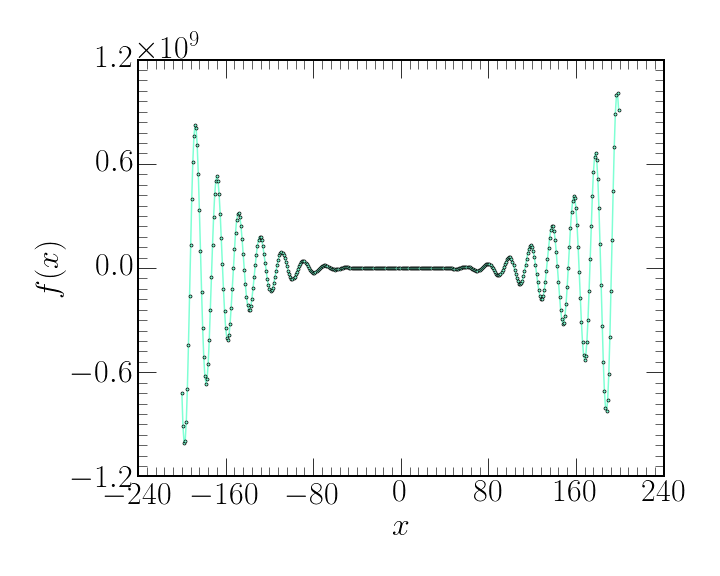

I tested the below function using my bisection method, my secant method, and the Brent method.

```python
def function_test(x):
    return (np.cos(x/np.pi)*((x*np.sqrt(1+x**2)*(2./3.*x**2-1)) + \
     np.log(x + np.sqrt(1+x**2))))/(np.tanh(x**2))**3+1/x
```

A plot of the function is shown below:



## Bisection

* The bisection method retrieves the correct root for the interval range, $[a,b]=1,10$. 
* The bisection method retrieves the **incorrect** root for the interval range, $[a,b]=1,100$. It retrieves the first root it finds, the same one as when $[a,b]=1,10$.


## Secant

* The secant method retrieves the correct root for the initial guess of $x_{0}=10$.
* The secant method retrieves the correct root of $\sim~74$ for the initial guess of $x_{0}=100$.


## Brent

* The Brent method retrieves the correct root for the interval range, $[a,b]=1,10$. 
* The Brent method fails for this interval $[a,b]=1,100$, with the following error:
```python
ValueError: f(a) and f(b) must have different signs
```

All methods work within there appropriate rules. Functions such as $\left | x^{1/4} \right |$ cause Secant method to fail due to the large first derivative.
